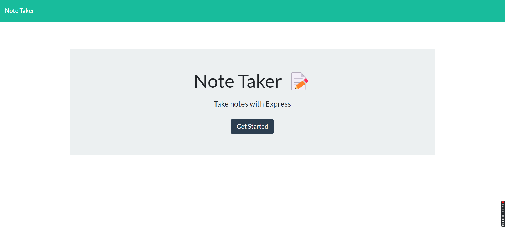
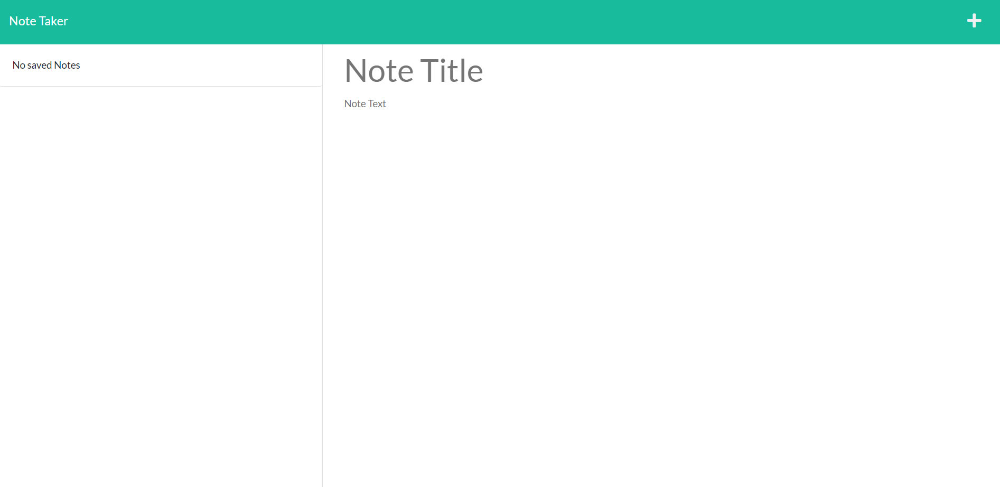
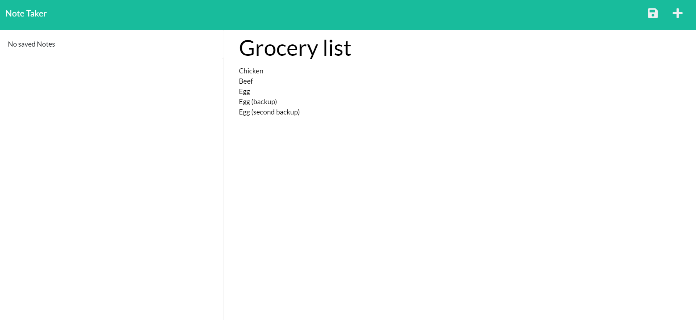
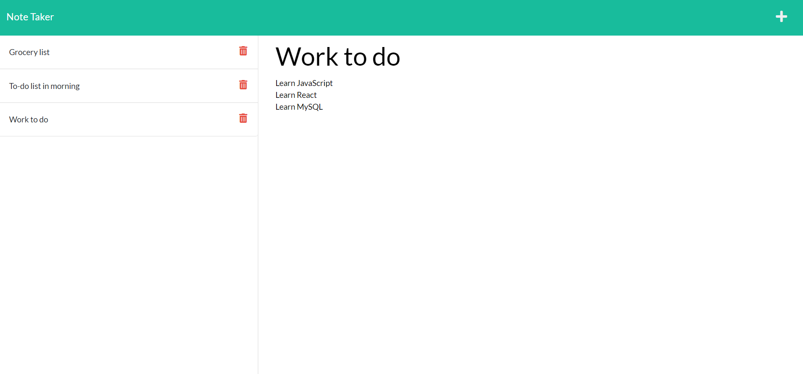

# Note Taker App

## Link to Deployed Application
https://note-taker-app-using-expressjs.herokuapp.com/

## Description
This application gives users the ability to write a note and save that note for later use. When users reach the home page of this application, they are presented with a landing page with a button that will take them to the notes page.

On the notes page, the left-hand side has previous notes already saved by the user, displayed from top to bottom. On the right-hand side, the user may write the title of a new note and the text of a new note they wish to save. 

If there is anything written on the right-hand side by the user, whether it is in the title or text, a save button will appear in the top-right hand side of the web page on the navigation bar. The user can click this button to save what they have written and add it to the list of saved notes on the left-hand side. There is also a new note button on the top-right in the navigation bar, the user can click this button to clear what has been written in the title and text area of the note on the right side of the page.

A user can also click one of the saved notes on the left-hand side for that note to be displayed on the right-hand side. 

## Screenshot of Application

